  

---

## 🛠️ 技術堆疊

### 程式語言

### 框架與工具

---

## 📊 GitHub 統計

  
  

---

## 📂 精選清單

<!-- START_GITHUB_LISTS -->
### 📂 [UG-Final Projects](https://github.com/stars/tsz7250/lists/ug-final-projects)
- [**1142_OpenPlatformSoftware_Final**](https://github.com/tsz7250/1142_OpenPlatformSoftware_Final) ` Python `  
  基於混合檢索與 LLM 技術之專利問答系統，專為中華民國智慧財產局（TIPO）專利常見問答 (FAQ) 開放資料集打造。

- [**1131_Chatbot_Final**](https://github.com/tsz7250/1131_Chatbot_Final) ` Python `  
  多模態聊天機器人，整合了電影相關的 AI 服務，包括智能對話、電影搜尋、圖片識別和字幕翻譯等功能。

- [**1122_Web_Final**](https://github.com/tsz7250/1122_Web_Final) ` HTML `  
  使用 Python Flask 框架開發的餐廳訂餐系統模擬應用程式，並應用了 PlotlyJS、Google Gemini、HTML5 Canvas 等技術。

- [**1111_WebProgramming_Final**](https://github.com/tsz7250/1111_WebProgramming_Final) ` HTML `  
  製作隨機選擇器，功能有進行食物類別、餐廳篩選的學餐隨機選擇器。使用者可以註冊帳號，使用記帳功能。

### 📂 [UG-Homeworks](https://github.com/stars/tsz7250/lists/ug-homeworks)
- [**1142_AI-assistedSoftwareDevelopment**](https://github.com/tsz7250/1142_AI-assistedSoftwareDevelopment) ` C++ `  

- [**1131_Chatbot**](https://github.com/tsz7250/1131_Chatbot) ` Python `  
  AI 聊天機器人集合：包含 Gemini 網頁聊天機器人、Line Bot、情感分析機器人、翻譯機器人、文字轉語音機器人等。

- [**1122_WebsiteProgrammingPractice**](https://github.com/tsz7250/1122_WebsiteProgrammingPractice) ` JavaScript `  
  網頁開發作業：驗證碼系統、資料處理（.csv/.xml）、Google Charts 折線圖、篩選查詢等。

- [**1112_ComputerProgramming**](https://github.com/tsz7250/1112_ComputerProgramming) ` C++ `  
  C++ 物件導向：Fibonacci Sequence、編碼機、Graph 和 Spanning Tree、撲克牌遊戲、多型計算四邊形。

- [**1122_HDL**](https://github.com/tsz7250/1122_HDL) ` VHDL `  
  VHDL 數位電路設計：包含 ALU、狀態機、計數器、LED 控制、紅綠燈控制等 15 個實驗專案。

### 📂 [Side Projects](https://github.com/stars/tsz7250/lists/side-projects)
- [**yzuCourseBot**](https://github.com/tsz7250/yzuCourseBot) ` Python `  
  本專案基於原始 yzuCourseBot 進行 fork 並針對 Windows、macOS、Android 與 iOS 環境進行優化與整合。

- [**Coursio**](https://github.com/tsz7250/Coursio) ` JavaScript `  
  參考 WannaClass 的框架進行重構，並優化課表查詢功能、自動選課等功能。 

- [**n8n-launcher**](https://github.com/tsz7250/n8n-launcher) ` Shell `  
  用於 Windows 的 n8n Docker 容器管理工具，提供圖形化選單介面來管理 n8n 工作流程自動化平台，支援一鍵啟動、自動配置、版本管理、資料備份與還原等功能。

- [**bible-tracker**](https://github.com/tsz7250/bible-tracker) ` JavaScript `  
  一個以 LINE Bot + Google Apps Script (GAS) 打造的讀經進度紀錄應用，幫助小組成員記錄每日讀經、追蹤完成度，並查看群組統計排名。

- [**Currency_chart**](https://github.com/tsz7250/Currency_chart) ` Python `  
  使用 Python Flask 框架開發多幣種匯率走勢圖，支援近 7／30／90／180 天圖表、幣別搜尋與交換，並在背景自動更新資料。

<!-- END_GITHUB_LISTS -->

---

  <h3>
    <a href="https://tsz7250.github.io">👉 查看完整作品集 👈</a>
  </h3>

